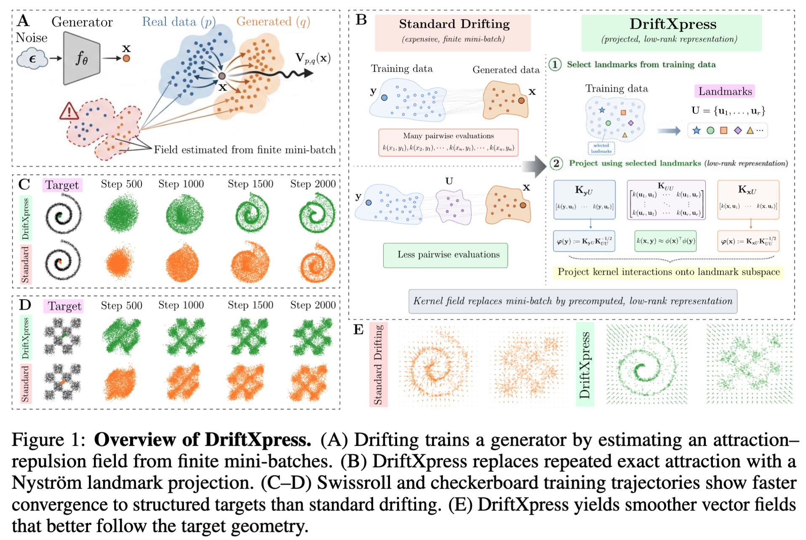
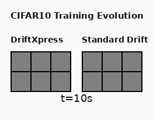

# DriftXpress

**Faster Drifting Models via Projected RKHS Fields**

This directory contains the training and evaluation code for **DriftXpress**, an accelerated training-time formulation of Drifting Models for one-step image generation.

Drifting Models replace iterative sampling with a single generator evaluation, but this shifts the main cost to training: the model repeatedly estimates an attraction-repulsion field through kernel interactions in feature space. DriftXpress targets this bottleneck. It replaces repeated exact attraction against the training support with a projected RKHS field built from landmarks and cached summaries, while keeping generated-sample repulsion exact for stability.

<p align="center">
  
</p>

<p align="center">
</p>


<p align="center">
  
</p>


The commands below assume the release directory is located at `Xpress/release/` and are run from the repository root.

## Supported datasets

| Dataset | CLI name |
|---|---|
| CIFAR-10 | `cifar10` |
| CIFAR-100 | `cifar100` |
| SVHN | `svhn` |
| ImageNet | `imagenet` |

## Supported methods

| Method | CLI name |
|---|---|
| Standard Drifting | `standard-drifting` |
| DriftXpress | `driftxpress` |

Release defaults live in:

```bash
Xpress/release/config/release_profiles.yaml
```

The unified runner takes `--dataset` and `--method`, then fills the rest from the release profile unless a value is explicitly overridden.

## Installation

Use a Python 3.11 environment.

```bash
conda create -n driftxpress python=3.11 -y
conda activate driftxpress
```

Install PyTorch and torchvision using the official wheel source for your CUDA runtime, then install the release dependencies:

```bash
pip install -r Xpress/release/requirements.txt
```


## Quick start

## Pretrained checkpoints

This release does not currently include downloadable pretrained generator checkpoints.
To make the project usable out of the box, please publish trained `drift_final.pt`
checkpoints for the supported dataset and method combinations, either as GitHub
release assets or in a public model hub, and document the download URLs here.

Suggested minimum release set:

| Dataset | Method | Suggested checkpoint path |
|---|---|---|
| CIFAR-10 | `driftxpress` | `checkpoints/cifar10/driftxpress/drift_final.pt` |
| CIFAR-10 | `standard-drifting` | `checkpoints/cifar10/standard/drift_final.pt` |
| CIFAR-100 | `driftxpress` | `checkpoints/cifar100/driftxpress/drift_final.pt` |
| SVHN | `driftxpress` | `checkpoints/svhn/driftxpress/drift_final.pt` |

Once checkpoints are published, users should be able to run evaluation without
first training on a CUDA machine:

```bash
python Xpress/release/report_fid.py \
  --dataset cifar10 \
  --checkpoint checkpoints/cifar10/driftxpress/drift_final.pt
```

Run DriftXpress on CIFAR-10:

```bash
torchrun --nproc_per_node=8 \
  Xpress/release/run_training.py \
  --dataset cifar10 \
  --method driftxpress \
  --output-dir Xpress/outputs/release/cifar10/driftxpress
```

Run Standard Drifting on CIFAR-10:

```bash
torchrun --nproc_per_node=8 \
  Xpress/release/run_training.py \
  --dataset cifar10 \
  --method standard-drifting \
  --output-dir Xpress/outputs/release/cifar10/standard
```

## Training

### CIFAR-10

```bash
torchrun --nproc_per_node=8 \
  Xpress/release/run_training.py \
  --dataset cifar10 \
  --method driftxpress \
  --output-dir Xpress/outputs/release/cifar10/driftxpress
```

```bash
torchrun --nproc_per_node=8 \
  Xpress/release/run_training.py \
  --dataset cifar10 \
  --method standard-drifting \
  --output-dir Xpress/outputs/release/cifar10/standard
```

### CIFAR-100

```bash
torchrun --nproc_per_node=8 \
  Xpress/release/run_training.py \
  --dataset cifar100 \
  --method driftxpress \
  --output-dir Xpress/outputs/release/cifar100/driftxpress
```

```bash
torchrun --nproc_per_node=8 \
  Xpress/release/run_training.py \
  --dataset cifar100 \
  --method standard-drifting \
  --output-dir Xpress/outputs/release/cifar100/standard
```

### SVHN

```bash
torchrun --nproc_per_node=8 \
  Xpress/release/run_training.py \
  --dataset svhn \
  --method driftxpress \
  --output-dir Xpress/outputs/release/svhn/driftxpress
```

```bash
torchrun --nproc_per_node=8 \
  Xpress/release/run_training.py \
  --dataset svhn \
  --method standard-drifting \
  --output-dir Xpress/outputs/release/svhn/standard
```

### ImageNet

Standard Drifting:

```bash
torchrun --nproc_per_node=8 \
  Xpress/release/run_training.py \
  --dataset imagenet \
  --method standard-drifting \
  --output-dir Xpress/outputs/release/imagenet/standard_ratio_10 \
  --train-sample-ratio 10
```

DriftXpress:

```bash
torchrun --nproc_per_node=8 \
  Xpress/release/run_training.py \
  --dataset imagenet \
  --method driftxpress \
  --output-dir Xpress/outputs/release/imagenet/driftxpress_ratio_10 \
  --imagenet32-class-ratio 10
```


## FID evaluation

Evaluate a DriftXpress checkpoint:

```bash
python Xpress/release/report_fid.py \
  --dataset cifar10 \
  --checkpoint Xpress/outputs/release/cifar10/driftxpress/checkpoints/drift_final.pt
```

Evaluate a Standard Drifting checkpoint:

```bash
python Xpress/release/report_fid.py \
  --dataset cifar10 \
  --checkpoint Xpress/outputs/release/cifar10/standard/checkpoints/drift_final.pt
```

ImageNet is also supported:

```bash
python Xpress/release/report_fid.py \
  --dataset imagenet \
  --checkpoint Xpress/outputs/release/imagenet/driftxpress_ratio_10/checkpoints/drift_final.pt
```

## Citation

If you use this code, please cite the paper:

```bibtex
@article{falahati2026driftxpress,
  title={DriftXpress: Faster Drifting Models via Projected RKHS Fields},
  author={Falahati, Ali and Creager, Elliot and Kamath, Gautam and Mohapatra, Shubhankar},
  journal={arXiv preprint arXiv:2605.12183},
  year={2026}
}
```


## Acknowledgments

This codebase builds on the Drifting Models training paradigm introduced by Deng et al. [1]. 

## References

```bibtex
@article{deng2026generative,
  title={Generative Modeling via Drifting},
  author={Deng, Mingyang and Li, He and Li, Tianhong and Du, Yilun and He, Kaiming},
  journal={arXiv preprint arXiv:2602.04770},
  year={2026}
}
